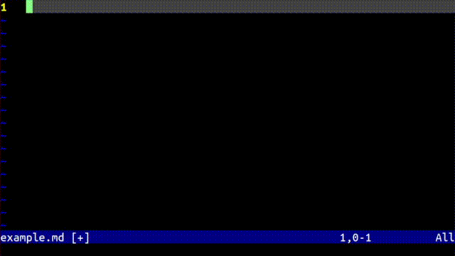

# Chat Vim

This is a plugin to talk to Chat GPT in neovim. To talk to ChatGPT in normal mode type `<leader>g` or in insert mode type `??` or '..'. The plugin will take lines starting with `GPT:` or following those lines as from GPT and lines starting with `>` as from you. If you want to start a new chat in the same file start a line with `>>`.



# Installation

```bash
git clone https://github.com/jakethekoenig/ChatVim.git ~/.vim/pack/misc/start/
cd ~/.vim/pack/misc/start/ChatVim
pip install -r requirements.txt # Only litellm and pynvim
export OPENAI_API_KEY=<YOUR API KEY> # If not already set
```

# Usage

The plugin infers a chat structure from the beginning of the file to the current line. The plugin infers who is talking from the following sequences at the start of the line. If no sequence is present than the current speaker is unchanged

| Sequence | Effect |
| --------- | --------- |
| `>>` | Starts a new chat. Previous lines ignored. Speaker is user. |
| `gpt-3.5-turbo>>` | Changed the model spoken to to GPT-3.5-turbo and starts a new chat. Speaker is user. |
| `gpt-4>>` | Changed the model spoken to to GPT-4 and starts a new chat. Speaker is user.|
| `>` | Speaker is user. Model is unchanged. |
| `GPT:` | Speaker is GPT. |

You can call the model by entering `..` or `??` in insert mode or `<leader>g` in normal mode. GPT's output is streamed in the next line. You can interrupt the model at any time. Just start typing.

The model defaults to `gpt-3.5-turbo` but this can be configured by setting `gpt_model` in your vimrc.
