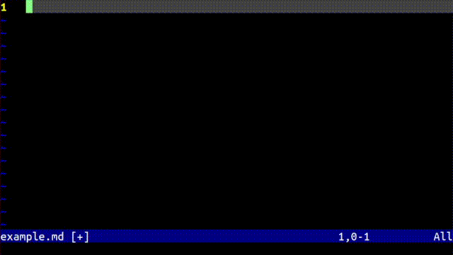

# Chat Vim

This is a plugin to talk to Chat GPT in neovim. To talk to ChatGPT in normal mode type `<leader>g` or in insert mode type `??` or '..'. The plugin will take lines starting with `GPT:` or following those lines as from GPT and lines starting with `>` as from you. If you want to start a new chat start a line with `>>`.



# Installation

You can install this plugin however you install neovim plugins. For instance if you use Vundle at the following to your vimrc.
```
Plugin jakethekoenig/VimOutline
```

Additionally you may have to install the python requirements (openai's api and pynvim) if your system doesn't already have them. In the plugin root:
```
pip install -r requirements.txt
```

You also need to have your Open AI api key as an environment variable:
```
export OPENAI_API_KEY=<YOUR API KEY>
```

# Usage

The plugin infers a chat structure from lines starting with `GPT:` `>` and `>>`. It gives this chat to GPT and inserts the response upon `<leader>g` in normal mode or `??` in insert mode. 

